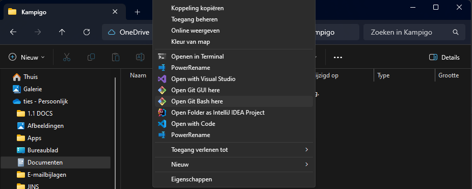
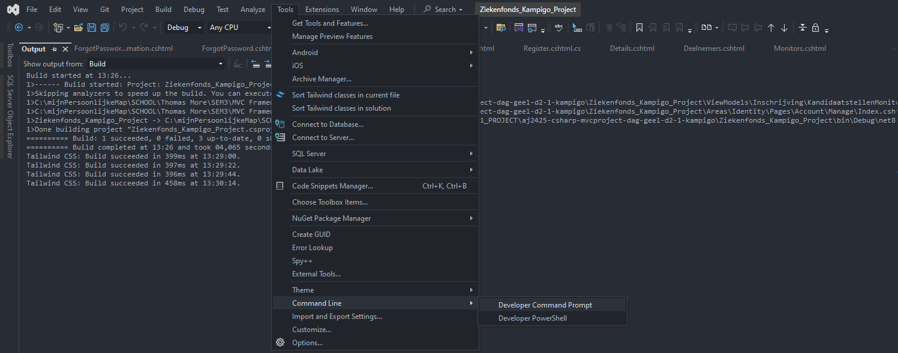
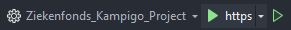

# Welkom bij Kampigo!
Om het project te kunnen bekijken, moet u eerst nog enkele stappen doorlopen.

 

## Het project installeren
1.	Download en installeer Git Bash (https://www.educative.io/answers/how-to-install-git-bash-in-windows)

2.	Open Git Bash door in een nieuwe map in verkenner te rechterklikken en dan vervolgens Git Bash aan te klikken  

3.  Typ het volgende commando en druk op enter: “git clone https://github.com/it-graduaten/aj2425-csharp-mvcproject-dag-geel-d2-1-kampigo.git”
  
4.	Er komt een nieuwe map in verkenner. Open deze map als project in Visual Studio (of andere IDE naar keuze). Wij gebruiken Visual Studio; het openen van de developer command console kan verschillen per IDE.

5.  In Visual Studio, open de DCP: Tools > Command Line > Developer Command Console

6.	Typ het volgende commando en druk op enter: “npm install“

7.	U kan nu het project openen door op 'Https' te drukken vanboven in de menubalk. 

  

## Het project testen
Bij het openen van de webapp ben je automatisch uitgelogd. De webapp is verbonden aan een online database waarin wij al enkele accounts voor u hebben aangemaakt om de functionaliteit te testen. Deze accounts noemen als volgt:  
Rollen: beheerder, verantwoordelijke.
Test Rollen: deelnemer, monitor, hoofdmonitor. Deze rollen  kunnen aangemaakt worden en toegewezen met nieuwe accounts.
Email: {rolnaam}@kampigo.be  
Wachtwoord: Welkom@01  

Om als monitor in te loggen gebruikt u dus het emailadres ‘monitor@kampigo.be’.
Als u een nieuw account registreert, wordt uw account toegewezen aan de ‘deelnemer’ rol. Indien u wenst uzelf als monitor toe te wijzen, moet u als beheerder inloggen en uw account toewijzen aan de monitor rol in het ‘gebruikers beheren’ dashboard.
 
## Automatische E-mailverzendingen

E-mails worden automatisch verzonden wanneer een gebruiker zich registreert of toegewezen wordt als monitor of hoofdmonitor. Deze e-mails worden verstuurd vanaf het adres: kampigoziekenfonds@gmail.com.
wachtwoord: Welkom@01

## Database
Het kan voorvallen dat de online database niet genoeg geheugen heeft, en dus de connectie niet wilt accepteren. In dit geval moet je even contact opnemen met ons, dan helpen wij u om de database even lokaal op te stellen en zo het project te testen. 
Teamlid: <r0990508@student.thomasmore.be>

## Toegang tot verzonden e-mails

Wilt u inloggen om de verzonden e-mails te bekijken? Neem dan voorlopig contact op met de student die de Gmail beheert. Er is namelijk tweefactorauthenticatie ingesteld, waarbij een verificatiecode naar de telefoon wordt gestuurd.

In de toekomst zal dit gekoppeld worden aan de klant.
Teamlid: <r0379766@student.thomasmore.be>

------------------------------------------------------------------------------------------
 

U kan nu de volledige applicatie doorlopen en de nodige functionaliteiten testen. Als er nog vragen zijn, kan u altijd contact opnemen via onderstaand emailadres. Wij verbinden u dan door met de juiste specialist uit ons team. 
Teamlid: <r0990508@student.thomasmore.be>

 

Veel testplezier!
